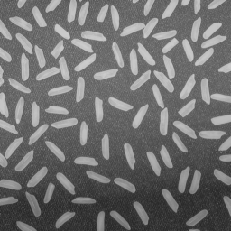

### Segmentation Exercise

**Count** the objects and **measure** their **size**

---

### Manual Segmentation

* Use the *Multi-point* selection tool to count all rice grains
* Use the *Freehand* selection tool and *Analyze > Measure* to measure the object area

+++

#### Working with Selections

The ROI Manager

* Selections, Regions Of Interest (ROI)
* ROI Manager
* *Analyze > Measure* and ROI Manager *Measure* command

---

### Semi-automatic Segmentation

+++

#### Wand (tracing) tool

* Use the *Wand (tracing) tool* to select whole rice grains
* Add each selection to the ROI manager
* Measure the ROIs

+++

#### Blow/Lasso tool

* Try selecting objects with *Plugins > Segmentation > Blow/Lasso Tool*

+++

#### Level sets

* Create a multi-point selection
* Run *Plugins > Segmentation > Level Sets*
* Optional: *Process > Find Maxima* to auto-generate point selection

---

### Automatic Segmentation

+++

#### Global thresholding

* *Image > Adjust > Threshold*
* *Analyze > Analyze Particles...*

+++

#### Local thresholding

+++

#### MorphoLibJ

* *Plugins > MorphoLibJ > Segmentation > Morphological Segmentation*
* Explore label images

---

### Binary images and skeletons

* *Plugins > Skeleton > Skeletonize (2D/3D)*
* *Analyze > Skeleton > Analyze Skeleton*
