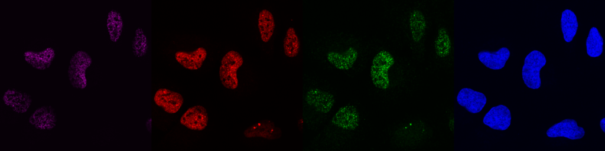
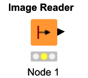
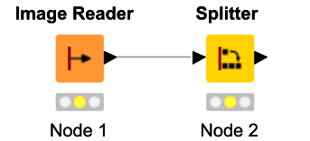
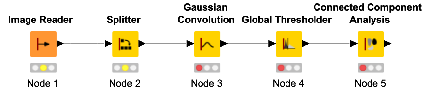
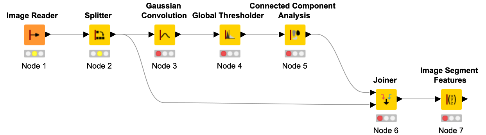
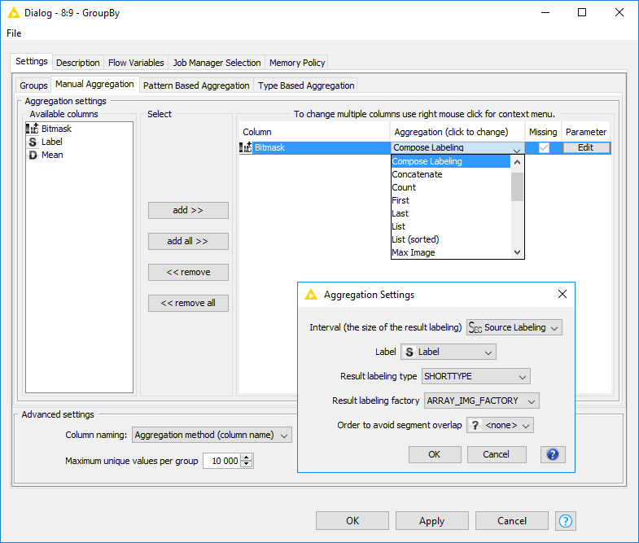
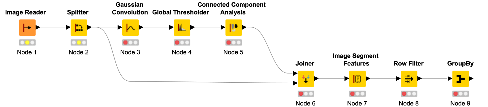
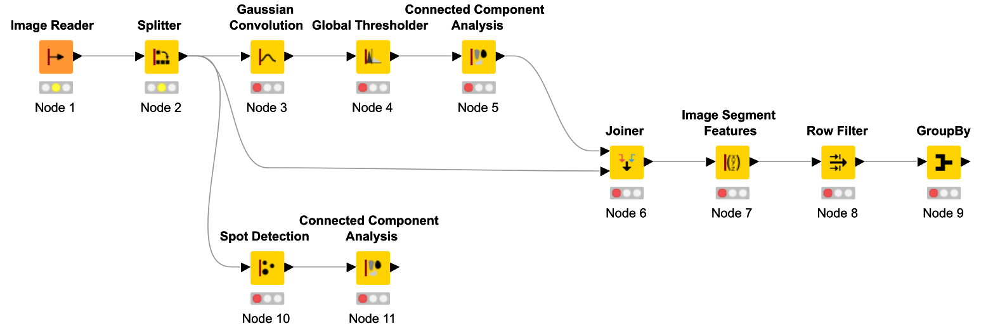
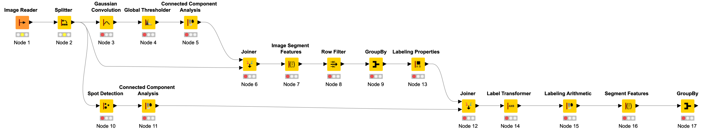
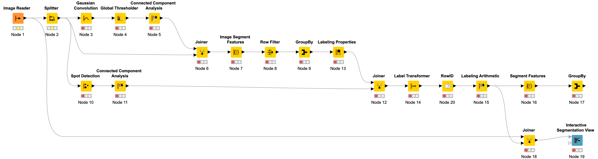

### Multi-channel segmentation and analysis

**Goal**: Create a simple segmentation workflow

---
### Dataset and Task

For each **nucleus** (Channel 4) positive for the **marker** (Channel 1), quantify the **number of foci** of the protein of interest (Channel 2)

---
### Workflow Overview

<table class="steps">
	<tr class="fragment">
		<td class="step-a">Step 1</td>
		<td class="step-b">Load image</td>
		<td class="step-c"><em>Image Reader</em> node</td>
	</tr>
	<tr class="fragment">
		<td class="step-a">Step 2</td>
		<td class="step-b">Split channels</td>
		<td class="step-c"><em>Splitter</em> node</td>
	</tr>
	<tr class="fragment">
		<td class="step-a">Step 3</td>
		<td class="step-b">Segment nuclei</td>
		<td class="step-c">Threshold-based segmentation</td>
	</tr>
	<tr class="fragment">
		<td class="step-a">Step 4</td>
		<td class="step-b">Measure intensity of marker channel</td>
		<td class="step-c">Label images and features</td>
	</tr>
	<tr class="fragment">
		<td class="step-a">Step 5</td>
		<td class="step-b">Filter objects by intensity</td>
		<td class="step-c">Decomposing, filtering and re-composing label images</td>
	</tr>
	<tr class="fragment">
		<td class="step-a">Step 6</td>
		<td class="step-b">Detect foci in channel of interest</td>
		<td class="step-c">Spot detection nodes</td>
	</tr>
	<tr class="fragment">
		<td class="step-a">Step 7</td>
		<td class="step-b">Count foci per nucleus</td>
		<td class="step-c">Merging and filtering labels</td>
	</tr>
</table>

---

### Step 1 – Assignment

* Aim
  * Open the provided czi image
* Hints
  * Simply drag the file onto a new workflow canvas
  * You can also search the node repository for *Image Reader*
  * Execute the node and use *right-click* - *View: Image Viewer* to inspect the loaded image

+++

### Step 1 – Solution

KNIME_catch-up_step-1.knwf <!-- .element: class="hint"-->

---

### Step 2 – Assignment

* Aim
  * Split channels
* Hint
  * Use the *Splitter* node with a suitable configuration

+++

### Step 2 – Solution

KNIME_catch-up_step-2.knwf <!-- .element: class="hint"-->

---

### Step 3 – Assignment

* Aim
  * Segment the nuclei in the DAPI channel (Ch4)
* Hints
  * Use global Otsu thresholding
  * Use Gaussian blurring to create smooth objects
  * Detect unique objects using connected-component analysis

+++

### Step 3 – Solution

KNIME_catch-up_step-3.knwf <!-- .element: class="hint"-->

---

### Step 4 – Assignment

* Aim
  * Measure intensity of marker channel (Ch1)
* Hints
  * Join the segmentation output with the image table
  * Use the *Image Segment Features* node and configure its *Features* tab
  * Have a look at the output table. How many rows does it contain?

+++

### Step 4 – Solution

KNIME_catch-up_step-4.knwf <!-- .element: class="hint"-->

---

### Step 5 – Assignment

* Aim
  * Filter the nuclei by their Ch1 intensity
* Hints
  * Use the *Row Filter* node and configure it to keep only intesities above `100`
  * Re-assemble a label image from the kept nuclei using the *GroupBy* node

+++

### Step 5 – Technical point

The *GroupBy* node allows to group multiple rows into a single row, with specifying any method to aggregate the grouped cells

+++

### Step 5 – Solution

KNIME_catch-up_step-5.knwf <!-- .element: class="hint"-->

---
### Step 6 – Assignment

* Aim
  * Detect foci in channel of interest (Ch2)
* Hint
  * Perform a spot detection followed by connected-component analysis

+++

### Step 6 – Solution

KNIME_catch-up_step-6.knwf <!-- .element: class="hint"-->

---
### Step 7 – Assignment

* Aim
  * Count the foci (Ch2) for each nucleus (Ch4) with a minimal marker (Ch1) intensity
* Hints
  * Join the required tables
  * Use the *Labeling Arithmetics* node to merge labels
  * We'll need to transform the nucleus labels before merging
  * Use the *Segment Features* node to find overlapping labels
  * Count the spot per cell using the *GroupBy* node

+++

### Step 7 – Solution

KNIME_catch-up_step-7.knwf <!-- .element: class="hint"-->

---

### Many more options

---

### What did we learn?

<table class="steps">
	<tr>
		<td class="step-a">Step 1</td>
		<td class="step-b">Load image</td>
		<td class="step-c"><em>Image Reader</em> node</td>
	</tr>
	<tr>
		<td class="step-a">Step 2</td>
		<td class="step-b">Split channels</td>
		<td class="step-c"><em>Splitter</em> node</td>
	</tr>
	<tr>
		<td class="step-a">Step 3</td>
		<td class="step-b">Segment nuclei</td>
		<td class="step-c">Threshold-based segmentation</td>
	</tr>
	<tr>
		<td class="step-a">Step 4</td>
		<td class="step-b">Measure intensity of marker channel</td>
		<td class="step-c">Label images and features</td>
	</tr>
	<tr>
		<td class="step-a">Step 5</td>
		<td class="step-b">Filter objects by intensity</td>
		<td class="step-c">Decomposing, filtering and re-composing label images</td>
	</tr>
	<tr>
		<td class="step-a">Step 6</td>
		<td class="step-b">Detect foci in channel of interest</td>
		<td class="step-c">Spot detection nodes</td>
	</tr>
	<tr>
		<td class="step-a">Step 7</td>
		<td class="step-b">Count foci per nucleus</td>
		<td class="step-c">Merging and filtering labels</td>
	</tr>
</table>
